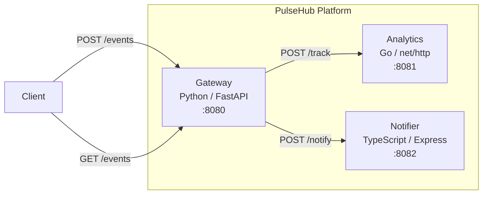

# PulseHub

Real-time event analytics platform built with a microservices architecture.

PulseHub collects, analyzes, and notifies on events in real time. It consists of three independent services communicating over HTTP, each built with a different language and framework.

## Architecture



## Services

| Service | Language | Framework | Port | Description |
|---------|----------|-----------|------|-------------|
| **Gateway** | Python 3.12 | FastAPI | 8080 | API gateway — receives events, manages CRUD |
| **Analytics** | Go 1.22 | net/http | 8081 | Tracks and aggregates event metrics |
| **Notifier** | TypeScript | Express 4 | 8082 | Sends notifications across channels |

## Quick Start

### Prerequisites

- Docker & Docker Compose
- (For local dev) Python 3.12+, Go 1.22+, Node.js 20+

### Run with Docker Compose

```bash
cp .env.example .env
make up
```

All services start on their respective ports. Verify with:

```bash
curl http://localhost:8080/health
curl http://localhost:8081/health
curl http://localhost:8082/health
```

### Stop

```bash
make down
```

## API Reference

### Gateway (`:8080`)

| Method | Endpoint | Description |
|--------|----------|-------------|
| GET | `/health` | Health check |
| POST | `/events` | Create an event (`{"name": "...", "payload": {...}}`) |
| GET | `/events` | List all events |
| GET | `/events/{id}` | Get event by ID |

### Analytics (`:8081`)

| Method | Endpoint | Description |
|--------|----------|-------------|
| GET | `/health` | Health check |
| POST | `/track` | Track an event (`{"event_name": "..."}`) |
| GET | `/metrics` | List aggregated metrics |

### Notifier (`:8082`)

| Method | Endpoint | Description |
|--------|----------|-------------|
| GET | `/health` | Health check |
| POST | `/notify` | Send notification (`{"channel": "...", "message": "..."}`) |
| GET | `/notifications` | List sent notifications |

## Usage Examples

```bash
# Create an event
curl -X POST http://localhost:8080/events \
  -H "Content-Type: application/json" \
  -d '{"name": "user_signup", "payload": {"user_id": 42}}'

# Track it in analytics
curl -X POST http://localhost:8081/track \
  -H "Content-Type: application/json" \
  -d '{"event_name": "user_signup"}'

# Send a notification
curl -X POST http://localhost:8082/notify \
  -H "Content-Type: application/json" \
  -d '{"channel": "email", "message": "New user signed up!"}'

# View metrics
curl http://localhost:8081/metrics
```

## Development

### Run Tests

```bash
make test        # Run all tests
make test-python # Gateway tests only
make test-go     # Analytics tests only
make test-ts     # Notifier tests only
```

### Lint

```bash
make lint
```

### Environment Variables

See [`.env.example`](.env.example) for all configurable variables.

## CI/CD

GitHub Actions workflow runs on every push and PR to `main`:

1. **test-python** — flake8 lint + pytest
2. **test-go** — go vet + go test
3. **test-typescript** — eslint + jest
4. **docker-build** — validates Docker Compose builds

> **Note**: The `.github/workflows/ci.yml` file may need to be manually added after the initial merge due to GitHub API restrictions on the `.github/` directory.

### CI Workflow Content

```yaml
name: CI

on:
  push:
    branches: [main]
  pull_request:
    branches: [main]

jobs:
  test-python:
    runs-on: ubuntu-latest
    defaults:
      run:
        working-directory: gateway
    steps:
      - uses: actions/checkout@v4
      - uses: actions/setup-python@v5
        with:
          python-version: "3.12"
      - run: pip install -r requirements.txt
      - run: flake8 --max-line-length=120 main.py test_main.py
      - run: pytest -v

  test-go:
    runs-on: ubuntu-latest
    defaults:
      run:
        working-directory: analytics
    steps:
      - uses: actions/checkout@v4
      - uses: actions/setup-go@v5
        with:
          go-version: "1.22"
      - run: go vet ./...
      - run: go test -v ./...

  test-typescript:
    runs-on: ubuntu-latest
    defaults:
      run:
        working-directory: notifier
    steps:
      - uses: actions/checkout@v4
      - uses: actions/setup-node@v4
        with:
          node-version: "20"
      - run: npm install
      - run: npx eslint src/
      - run: npm test

  docker-build:
    runs-on: ubuntu-latest
    needs: [test-python, test-go, test-typescript]
    steps:
      - uses: actions/checkout@v4
      - run: docker compose build
```

## License

MIT
